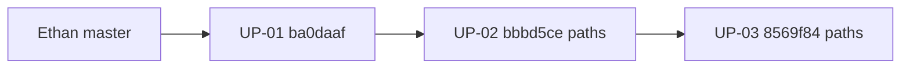

# Upstream UP-01 → UP-03 Cut Plan

> **For agentic workers:** REQUIRED SUB-SKILL: Use superpowers:subagent-driven-development (recommended) or superpowers:executing-plans to implement this plan task-by-task. Steps use checkbox (`- [ ]`) syntax for tracking.
>
> **Spec:** `docs/superpowers/specs/2026-07-21-upstream-pr-queue-design.md`

**Goal:** Open the first three chronological PRs against [ethanbustad/gene-autoannotator](https://github.com/ethanbustad/gene-autoannotator): model modes (UP-01), comparison harness (UP-02), then PMC relevance filter (UP-03) — one open PR at a time.

**Architecture:** Each PR is an **end-state file snapshot** from a chosen tip SHA on the fork, applied onto Ethan’s current `master` (after prior PRs merge). No cherry-pick of merge-heavy history. Stage named paths only.

**Tech Stack:** Python package `autoannotation/`, pytest, optional Ollama for compare LLM tests; GitHub PRs via `gh`.

## Global Constraints

- Target remote: `git@github.com:ethanbustad/gene-autoannotator.git` (add as `upstream` if missing).
- Workflow A: **one open PR at a time**; do not open UP-02 until UP-01 is merged (unless Ethan asks to stack).
- Never stage: logs, sqlite, `tests/benchmark_results/`, secrets, `node_modules/`, generated annotation dumps.
- No `git add .` / `git add -A` — named paths only.
- Save a recoverable backup ref before moving work (`refs/backup/…`) if the working tree is dirty.
- Update queue statuses in `docs/superpowers/specs/2026-07-21-upstream-pr-queue-design.md` as each PR opens/merges.
- Size reference: UP-03 ≈ relevance filter (~6–11 files, ~0.75–1.6k LOC).

---

## File map (cuts)

### UP-01 — tip `ba0daaf`

| Path | Action | Role |
|------|--------|------|
| `autoannotation/models.py` | Add | `PERF_MODELS` / `LITE_MODELS` + `MODE` selection → `MODEL_*` |
| `autoannotation/autoannotation.py` | Modify | Import `MODEL_*` from `models` instead of hardcoding |
| `README.md` | Modify | High-level overview + model-mode notes from that tip |

**Diff vs Ethan base `748e577`:** 3 files, **+60 / −4**.

### UP-02 — tip `bbbd5ce`

| Path | Action | Role |
|------|--------|------|
| `compareannotations/__init__.py` | Add | Package |
| `compareannotations/__main__.py` | Add | CLI entry |
| `compareannotations/core.py` | Add | Compare orchestration |
| `compareannotations/scoring.py` | Add | Exact / embed / LLM scoring |
| `compareannotations/metrics.py` | Add | Metrics helpers |
| `compareannotations/functional_category.py` | Add | GO / category comparison |
| `run_pipeline.py` | Add | Benchmark / baseline runner |
| `requirements.txt` | Add | Python deps (incl. compare stack) |
| `tests/test_exact.py` | Add | Exact-match tests |
| `tests/test_embed.py` | Add | Embedding tests |
| `tests/test_llm.py` | Add | LLM judge tests |
| `tests/test_llm_unknowns.py` | Add | Partial-evidence / unknown handling |
| `tests/test_compare_coverage.py` | Add | Coverage helpers |

**Diff vs Ethan base (paths only):** 13 files, **+1580**. Full compare feature through GO terms + lazy-load era, **without** pulling PMC relevance files.

**Exclude:** `gen_json/`, `trust_json/`, run logs, annotation note dumps.

### UP-03 — tip `8569f84`

| Path | Action | Role |
|------|--------|------|
| `autoannotation/pmc.py` | Replace from tip | Relevance scoring, budget selection, inline `OrganismProfile`, NCBI 503 handling |
| `autoannotation/metadata.py` | Add | Paper-selection metadata + notes helpers |
| `autoannotation/autoannotation.py` | Replace from tip | Wire `select_relevance_records` + metadata into annotation flow |
| `get_papers.py` | Add | Diagnostic CLI for retrieval/ranking |
| `tests/test_pmc_relevance.py` | Add | Relevance unit tests |
| `tests/test_autoannotation_relevance.py` | Add | Selection/budget tests |
| `tests/test_get_papers.py` | Add | CLI helper tests |

**Diff vs Ethan base (paths only):** 7 files, **~+1505 / −58** (post-UP-01/02 the reviewable delta is smaller — mostly pmc/metadata/get_papers/tests).

**Do not include in UP-03:** `autoannotation/llms.py` prompt polish from `b21c3de` (ships in a later PR if still needed). Organism profile at this tip lives **inside** `pmc.py` (multi-organism module is UP-04).

**Skip historical churn:** do not replay `9dd64dd` / `840c1e0` add-then-remove retries — tip `8569f84` already has final NCBI 503 behavior.



---

### Task 1: Prep remotes and backup

**Files:** none (git remotes / refs only)

**Interfaces:**
- Consumes: local fork `master`, GitHub access
- Produces: `upstream` remote; clean fetch of Ethan `master`

- [ ] **Step 1: Verify clean or snapshot dirty tree**

```bash
cd /home/caden-saltzberg/projects/sch/gene-autoannotator
git status -sb
SHA=$(git stash create "pre-upstream-up01")
if [ -n "$SHA" ]; then
  git update-ref "refs/backup/pre-upstream-up01-$(date +%s)" "$SHA"
  echo "Backup ref created at $SHA"
fi
```

Expected: working tree clean, or a `refs/backup/…` SHA printed.

- [ ] **Step 2: Add and fetch upstream**

```bash
git remote add upstream git@github.com:ethanbustad/gene-autoannotator.git 2>/dev/null || true
git remote -v
git fetch upstream
git log --oneline upstream/master | head -5
```

Expected: `upstream/master` shows Ethan’s 4 commits ending at package split (`748e577` or equivalent).

- [ ] **Step 3: Mark queue UP-01 in_progress**

In `docs/superpowers/specs/2026-07-21-upstream-pr-queue-design.md`, set UP-01 Status to `in_progress` in both the summary table and the UP-01 section. Stage with `git add -f` (docs/ is gitignored) and commit on fork `master` only if you want the queue tracked — optional for this task; required before opening the PR wave if the queue is the team source of truth.

---

### Task 2: Cut and open UP-01 (model modes)

**Files:**
- Create from tip: `autoannotation/models.py`
- Modify from tip: `autoannotation/autoannotation.py`, `README.md`
- Test: import smoke + existing package entry (no dedicated model-mode tests at this tip)

**Interfaces:**
- Consumes: `upstream/master`
- Produces: branch `upstream/UP-01-model-modes` → PR into Ethan `master`
- Exports for later PRs: `MODEL_SUMMARY`, `MODEL_CONSENSUS`, `MODEL_AGGREGATION`, `MODE` in `autoannotation/models.py`

- [ ] **Step 1: Branch from Ethan**

```bash
git fetch upstream
git checkout -B upstream/UP-01-model-modes upstream/master
```

- [ ] **Step 2: Snapshot files from tip `ba0daaf`**

```bash
TIP01=ba0daaf
git checkout $TIP01 -- README.md autoannotation/models.py autoannotation/autoannotation.py
git status -sb
git diff --stat
```

Expected: 3 paths staged/modified; ~+60/−4 vs branch base.

- [ ] **Step 3: Sanity check models module**

```bash
python -c "from autoannotation.models import MODE, MODEL_SUMMARY, MODEL_CONSENSUS, MODEL_AGGREGATION; print(MODE, MODEL_SUMMARY, MODEL_CONSENSUS, MODEL_AGGREGATION)"
```

Expected: prints `performance` (or `lite` if tip set that) and model id lists/strings.

- [ ] **Step 4: Commit**

```bash
git add README.md autoannotation/models.py autoannotation/autoannotation.py
git commit -m "$(cat <<'EOF'
feat: add lite/performance model mode definitions

EOF
)"
```

- [ ] **Step 5: Push and open PR**

```bash
git push -u origin upstream/UP-01-model-modes
gh pr create --repo ethanbustad/gene-autoannotator \
  --head cadsaltz:upstream/UP-01-model-modes \
  --base master \
  --title "feat: add lite/performance model mode definitions" \
  --body "$(cat <<'EOF'
## Summary
- Introduce `autoannotation/models.py` with performance vs lite Ollama model sets and a `MODE` switch.
- Wire `autoannotation/autoannotation.py` to import `MODEL_*` instead of hardcoding model ids.
- Document the high-level pipeline / model modes in the README.

## Test plan
- [ ] `python -c "from autoannotation.models import MODE, MODEL_SUMMARY; print(MODE, MODEL_SUMMARY)"`
- [ ] Skim README for accuracy vs Ethan's package layout

EOF
)"
```

- [ ] **Step 6: Update queue** — Status `open`; paste PR URL under UP-01 Notes.

- [ ] **Step 7: Stop** — Do not start UP-02 until this PR is **merged** (workflow A).

---

### Task 3: Cut and open UP-02 (compareannotations) — after UP-01 merges

**Files:** see UP-02 table above (13 paths from tip `bbbd5ce`)

**Interfaces:**
- Consumes: `upstream/master` **after UP-01 merge**
- Produces: branch `upstream/UP-02-compareannotations` → PR
- Does not modify `autoannotation/pmc.py` (that is UP-03)

- [ ] **Step 1: Sync and branch**

```bash
git fetch upstream
git checkout -B upstream/UP-02-compareannotations upstream/master
```

Confirm UP-01 files are present (`autoannotation/models.py` exists).

- [ ] **Step 2: Snapshot compare paths from tip `bbbd5ce`**

```bash
TIP02=bbbd5ce
git checkout $TIP02 -- \
  compareannotations/__init__.py \
  compareannotations/__main__.py \
  compareannotations/core.py \
  compareannotations/scoring.py \
  compareannotations/metrics.py \
  compareannotations/functional_category.py \
  run_pipeline.py \
  requirements.txt \
  tests/test_exact.py \
  tests/test_embed.py \
  tests/test_llm.py \
  tests/test_llm_unknowns.py \
  tests/test_compare_coverage.py
git status -sb
git diff --stat
```

Expected: ~13 files added; on the order of **+1.5k** lines. No `pmc.py` / relevance tests.

- [ ] **Step 3: Run deterministic compare unit tests**

```bash
python -m pip install -r requirements.txt
pytest tests/test_exact.py tests/test_compare_coverage.py -q
```

Expected: PASS (no Ollama required for exact/coverage).

Optional (needs models/GPU): `pytest tests/test_embed.py tests/test_llm.py tests/test_llm_unknowns.py -q` — note in PR body if skipped.

- [ ] **Step 4: Commit**

```bash
git add \
  compareannotations/__init__.py \
  compareannotations/__main__.py \
  compareannotations/core.py \
  compareannotations/scoring.py \
  compareannotations/metrics.py \
  compareannotations/functional_category.py \
  run_pipeline.py \
  requirements.txt \
  tests/test_exact.py \
  tests/test_embed.py \
  tests/test_llm.py \
  tests/test_llm_unknowns.py \
  tests/test_compare_coverage.py
git commit -m "$(cat <<'EOF'
feat: add annotation comparison and scoring harness

EOF
)"
```

- [ ] **Step 5: Push and open PR**

```bash
git push -u origin upstream/UP-02-compareannotations
gh pr create --repo ethanbustad/gene-autoannotator \
  --head cadsaltz:upstream/UP-02-compareannotations \
  --base master \
  --title "feat: add annotation comparison and scoring harness" \
  --body "$(cat <<'EOF'
## Summary
- Add `compareannotations/` for trusted-vs-generated scoring (exact, embeddings, LLM judge, GO/category).
- Add `run_pipeline.py` baseline runner and `requirements.txt`.
- Add unit tests for exact match, coverage, and LLM/unknowns helpers.

## Test plan
- [ ] `pytest tests/test_exact.py tests/test_compare_coverage.py -q`
- [ ] Optional: embed/LLM tests if Ollama + models available
- [ ] Confirm no generated `gen_json/` corpora included

EOF
)"
```

- [ ] **Step 6: Update queue** — UP-02 `open`; stop until merged.

---

### Task 4: Cut and open UP-03 (relevance filter) — after UP-02 merges

**Files:** see UP-03 table (7 paths from tip `8569f84`)

**Interfaces:**
- Consumes: `upstream/master` after UP-01 + UP-02
- Produces: branch `upstream/UP-03-relevance-filter` → PR
- Relies on: `MODEL_*` from UP-01; existing `http_`, `papers`, `utils` on Ethan’s tree

- [ ] **Step 1: Sync and branch**

```bash
git fetch upstream
git checkout -B upstream/UP-03-relevance-filter upstream/master
```

- [ ] **Step 2: Snapshot relevance paths from tip `8569f84`**

```bash
TIP03=8569f84
git checkout $TIP03 -- \
  autoannotation/pmc.py \
  autoannotation/metadata.py \
  autoannotation/autoannotation.py \
  get_papers.py \
  tests/test_pmc_relevance.py \
  tests/test_autoannotation_relevance.py \
  tests/test_get_papers.py
git status -sb
git diff --stat
```

Expected: `metadata.py` + `get_papers.py` + relevance tests new; `pmc.py` / `autoannotation.py` substantially updated. **Do not** checkout `llms.py` from this tip.

- [ ] **Step 3: Run relevance unit tests**

```bash
pytest tests/test_pmc_relevance.py tests/test_autoannotation_relevance.py tests/test_get_papers.py -q
```

Expected: PASS (tests use fakes; no NCBI required).

- [ ] **Step 4: Import smoke**

```bash
python -c "from autoannotation.pmc import PmcPaperManager, DEFAULT_TARGET_RELEVANCE; from autoannotation import metadata; print(DEFAULT_TARGET_RELEVANCE, metadata.SELECTION_MODE_BUDGET)"
```

Expected: prints target relevance float and budget mode constant.

- [ ] **Step 5: Commit**

```bash
git add \
  autoannotation/pmc.py \
  autoannotation/metadata.py \
  autoannotation/autoannotation.py \
  get_papers.py \
  tests/test_pmc_relevance.py \
  tests/test_autoannotation_relevance.py \
  tests/test_get_papers.py
git commit -m "$(cat <<'EOF'
feat: improve PMC relevance ranking and paper-selection budget

EOF
)"
```

- [ ] **Step 6: Push and open PR**

```bash
git push -u origin upstream/UP-03-relevance-filter
gh pr create --repo ethanbustad/gene-autoannotator \
  --head cadsaltz:upstream/UP-03-relevance-filter \
  --base master \
  --title "feat: improve PMC relevance ranking and paper-selection budget" \
  --body "$(cat <<'EOF'
## Summary
- Rank PMC papers with organism/gene relevance signals and a cumulative relevance budget for how many papers to analyze.
- Attach transparent paper-selection metadata / notes helpers (`autoannotation/metadata.py`).
- Add `get_papers.py` diagnostic CLI and unit tests for relevance + selection.

## Test plan
- [ ] `pytest tests/test_pmc_relevance.py tests/test_autoannotation_relevance.py tests/test_get_papers.py -q`
- [ ] Spot-check `get_papers.py --help` if argparse is present

EOF
)"
```

- [ ] **Step 7: Update queue** — UP-03 `open` → on merge `merged`. Next in queue is UP-04 (out of scope for this plan).

---

## Self-check (plan vs spec)

| Spec item | Covered? |
|-----------|----------|
| Chronological UP-01 → UP-03 | Yes |
| One open PR at a time | Tasks 2/3/4 each end with Stop until merge |
| End-state snapshot extraction | `git checkout $TIP -- <paths>` |
| UP-03 size reference / include organism + metadata + NCBI 503 via tip | Tip `8569f84` |
| Exclude noise / no full `git add` | Named paths only |
| Living queue updates | Steps after each PR |

**Known follow-ups (not in these three PRs):** `llms.py` May-18 prompt polish; multi-organism module (UP-04); anything after `8569f84`.

---

## Execution handoff

Plan complete and saved to `docs/superpowers/plans/2026-07-21-upstream-up01-up03.md`.

**Two execution options:**

1. **Subagent-Driven (recommended)** — fresh subagent per task, review between tasks  
2. **Inline Execution** — run tasks in this session with checkpoints  

**Which approach?** When you say go, start with Task 1 + UP-01 only (do not open UP-02/03 until Ethan merges).
