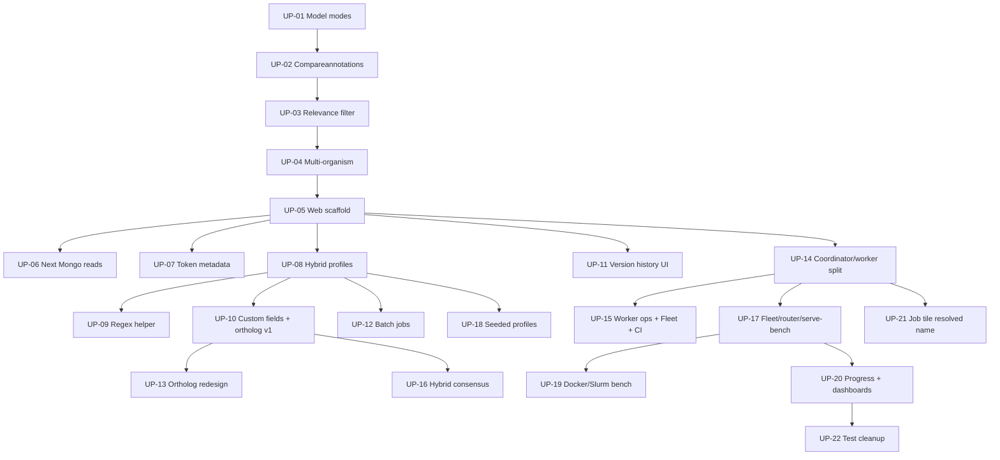

# Upstream Feature PR Queue

**Date:** 2026-07-21  
**Status:** approved — living document  
**Target:** [ethanbustad/gene-autoannotator](https://github.com/ethanbustad/gene-autoannotator)  
**Fork tip measured:** `be54564` on `cadsaltz/gene-autoannotator`  
**Ethan base:** `748e577` (*Split python script out into package*, 2026-03-31) — still matches upstream `master` (4 commits)

## Goals

- Land the **full useful fork** into Ethan’s repo as a sequence of reviewable PRs.
- Open PRs **chronologically** (earliest work first), **one open PR at a time**.
- Keep this file as the **source of truth** for what is queued, open, merged, or deferred — append new `UP-NN` entries as features land on the fork.

## Non-goals

- Rewriting or force-pushing Ethan’s history.
- Upstreaming noise (logs, local DBs, benchmark dumps, secrets, generated run artifacts).
- Opening many PRs in one day / maintaining a long open stack.
- Preserving every original merge commit; PRs use clean end-state snapshots.

## Workflow (locked)

1. Develop normally on the fork (`master`).
2. When ready to upstream the next queued item, create a branch from **Ethan’s current `master`**.
3. Apply an **end-state file snapshot** for that feature’s paths (reconstruct from the chosen tip SHA on the fork), as 1–few clean commits. Prefer path-based reconstruction over cherry-picking merge-heavy ranges.
4. Open **one** PR against `ethanbustad/gene-autoannotator`.
5. Wait for merge (or address review). Then open the next.
6. Optionally draft the *next* branch locally while waiting — do not open it yet.
7. New features built on the fork after this queue was written go to **UP-23+** at the bottom (or merge into an unopened earlier UP if they are tiny fixes for that feature).

### Remotes (when executing)

```bash
git remote add upstream git@github.com:ethanbustad/gene-autoannotator.git   # if missing
git fetch upstream
git fetch origin
```

### Extraction method (per PR)

**End-state file snapshot (preferred):**

1. Identify include paths + tip SHA where the feature is complete on the fork.
2. From `upstream/master` (or post-merge tip), check out those paths from the tip SHA / assemble the tree.
3. Commit with a clear conventional message (`feat: …` / `fix: …`).
4. Run focused tests for that slice before opening the PR.

Do **not** use `git add .` / `git add -A`. Stage named paths only.

## Size reference

**UP-03 (PMC relevance filter)** is the calibration unit:

| Metric | Core (`4d5724b`) | + organism / metadata / NCBI 503 |
|--------|------------------|----------------------------------|
| Files  | ~6               | ~8–11                            |
| LOC    | ~+749 / −236     | ~+0.75k–1.6k                     |

Target each PR near that size when possible. Larger items may split on review (`UP-17a/b`, `UP-20a/b`).

## Global exclude (never upstream)

- `log.txt`, `log1.txt`, `error_log.txt`, `run_log.txt`
- `completed_genes.txt`, `name_query_results.txt`
- `*.sqlite3` / `backend/jobs.sqlite3`
- `tests/benchmark_results/**`
- `.env`, `worker.env`, credentials
- `.cache/`, `.venv/`, `__pycache__/`, `node_modules/`
- Generated annotation dumps (`gen_json/`, large pipeline outputs) unless Ethan explicitly wants fixtures
- Observational memory profiler (`scripts/profile_job_memory.py`) — **deferred** unless requested

`frontend/package-lock.json` may be included with frontend PRs for reproducible installs.

## How to append

When a new feature is finished on the fork:

1. Add a new `### UP-NN` section at the bottom (next free number).
2. Fill Status, Era, Depends on, Approx tip, Include, Exclude, Notes.
3. Add a row to the summary table.
4. Update the mermaid diagram if dependencies changed.
5. Keep Status values exact: `queued` | `in_progress` | `open` | `merged` | `deferred` | `skipped`

---

## Dependency overview



## Summary table

| ID | Title | Era | Depends | Size vs UP-03 | Status |
|----|-------|-----|---------|---------------|--------|
| UP-01 | Lite/performance model modes | 2026-04-07 | — | smaller | open |
| UP-02 | Annotation comparison scoring harness | 2026-04-16 → 05-08 | UP-01 | ~1–2× | queued |
| UP-03 | PMC relevance filter + paper budget | 2026-05-18 → 05-19 | UP-01 | **reference** | queued |
| UP-04 | Multi-organism / strain validation + search | 2026-05-20 | UP-03 | ~1.5× | queued |
| UP-05 | Next.js frontend + FastAPI backend scaffold | 2026-05-26 → 06-02 | UP-04 | ~2× | queued |
| UP-06 | Next.js Mongo annotation read routes | 2026-06-05 | UP-05 | ~1× | queued |
| UP-07 | Ollama token usage metadata | 2026-06-05 | UP-05 | smaller | queued |
| UP-08 | Hybrid profiles + target submission | 2026-06-15 | UP-05 | ~2–3× | queued |
| UP-09 | Locus regex generation helper | 2026-06-15 → 06-16 | UP-08 | ~1× | queued |
| UP-10 | Custom fields + ortholog v1 | 2026-06-28 → 06-29 | UP-08 | ~2× | queued |
| UP-11 | Annotation version history UI | 2026-06-28 | UP-06 | smaller | queued |
| UP-12 | Batch gene-list job submission | 2026-06-29 | UP-08 | ~1.5× | queued |
| UP-13 | Ortholog fallback redesign | 2026-07-03 | UP-10, UP-12 | ~1–1.5× | queued |
| UP-14 | Coordinator + leased workers split | 2026-07-03 | UP-05 | ~1.5× | queued |
| UP-15 | Worker bootstrap, Fleet UI, CI, compose | 2026-07-04 | UP-14 | ~1.5–2× | queued |
| UP-16 | Hybrid section consensus | 2026-07-06 → 07-13 | UP-10 | ~1.5× | queued |
| UP-17 | Worker fleet, model router, serve/bench | 2026-07-08 → 07-13 | UP-14, UP-15 | ~2–3× | queued |
| UP-18 | Curated `data/profiles/` | 2026-07-14 → 07-15 | UP-08 | ~1× | queued |
| UP-19 | Worker-bench Docker + Slurm | 2026-07-14 | UP-17 | ~1× | queued |
| UP-20 | Structured job progress + dashboards | 2026-07-16 | UP-17 | ~2× | queued |
| UP-21 | Preflight-resolved names on job tiles | 2026-07-16 | UP-14 | smaller | queued |
| UP-22 | Align stale tests with current APIs | 2026-07-21 | prior | cleanup | queued |
| UP-23+ | *(append new fork features here)* | future | … | … | — |

---

## Queue entries

### UP-01 — Add lite/performance model modes

- **Status:** open
- **Era:** 2026-04-07
- **Depends on:** —
- **Approx tip:** `ba0daaf` (*changed models for smaller models*)
- **Key commits:** `814e257`, `1537eb3`, `76f9991`, `ba0daaf` (+ README polish if useful)
- **Include:** `autoannotation/models.py`, related mode-switching in `autoannotation/llms.py` / `autoannotation/autoannotation.py` as of tip; README notes for modes
- **Exclude:** generated annotations from early runs (`436a560` run outputs)
- **Notes:** First PR to open. Keep focused on model definitions + switching. Compare URL (open PR manually): https://github.com/ethanbustad/gene-autoannotator/compare/master...cadsaltz:gene-autoannotator:upstream/UP-01-model-modes?expand=1

### UP-02 — Add annotation comparison scoring harness

- **Status:** queued
- **Era:** 2026-04-16 → 2026-05-08
- **Depends on:** UP-01
- **Approx tip:** `23dad55` (*full pipeline and baseline score program*) — fold later compare polish through May 19 only if still compare-only
- **Key commits:** `2caad32` … `23dad55`; later GO/category work `4e167c2`, `bbbd5ce`, `c5bf7ca` if still in compareannotations
- **Include:** `compareannotations/`, `run_pipeline.py`, related tests, requirements needed for compare/scoring
- **Exclude:** `gen_json/`, `trust_json/` bulk outputs, pipeline run logs
- **Notes:** Do not upstream large generated JSON corpora.

### UP-03 — Improve PMC relevance ranking and paper-selection budget

- **Status:** queued
- **Era:** 2026-05-18 → 2026-05-19
- **Depends on:** UP-01 (soft); after UP-02 chronologically
- **Approx tip:** `8569f84` (*added handling for ncbi 503 responses*) or `b5a5ec5` if keeping organism-in-relevance tight
- **Key commits:** `4d5724b` (*better relevance filter*), `b5a5ec5`, `8994159`, `8569f84`
- **Include:** `autoannotation/pmc.py`, `autoannotation/autoannotation.py` (selection/budget hooks), `get_papers.py`, `tests/test_pmc_relevance.py`, `tests/test_autoannotation_relevance.py`, `tests/test_get_papers.py`; paper-selection metadata pieces if small
- **Exclude:** add/remove PMC retry churn (`9dd64dd` / `840c1e0`) — ship the final behavior only
- **Notes:** **Size reference PR.** Spec: none dedicated.

### UP-04 — Multi-organism validation and generalized organism search

- **Status:** queued
- **Era:** 2026-05-20
- **Depends on:** UP-03
- **Approx tip:** `c224170`
- **Key commits:** `3e1c21f`, `c224170`
- **Include:** `autoannotation/organisms.py`, validation/target helpers, PMC/search wiring for organisms, related tests
- **Exclude:** noise
- **Notes:** Precursor to hybrid profiles (UP-08).

### UP-05 — Scaffold Next.js frontend and FastAPI job backend

- **Status:** queued
- **Era:** 2026-05-26 → 2026-06-02
- **Depends on:** UP-04
- **Approx tip:** `85887ff` (*Remove tracked node_modules and fix gitignore*) — ensure node_modules never return
- **Key commits:** `1c72a51`, `4f8e1d2`, UI/network polish through early June
- **Include:** `frontend/` (app, components, lib, package files), `backend/` as it existed pre-rename, README usage for web stack
- **Exclude:** `node_modules/`, local `.env`, sqlite DBs
- **Notes:** Larger than reference; still one PR unless Ethan asks to split UI vs API.

### UP-06 — Serve annotation search/health from Next Mongo routes

- **Status:** queued
- **Era:** 2026-06-05
- **Depends on:** UP-05
- **Approx tip:** end of Next-Mongo work on that day (prefer final state after revert/re-merge noise)
- **Include:** `frontend/lib/annotationStore.js`, `frontend/app/api/annotations/**`, related health/search UI wiring
- **Exclude:** merge/revert commits as separate history — ship final tree only
- **Notes:** Local plan may exist under gitignored docs.

### UP-07 — Capture and display Ollama token usage in metadata

- **Status:** queued
- **Era:** 2026-06-05
- **Depends on:** UP-05
- **Approx tip:** `47484b5` / companion token commits
- **Include:** `autoannotation/llms.py`, `autoannotation/metadata.py`, `frontend/lib/annotationDisplay.js` (display bits)
- **Exclude:** —
- **Notes:** Smaller than reference; may merge into UP-06 if Ethan prefers fewer tiny PRs.

### UP-08 — Hybrid builtin/user/ad-hoc profiles and target resolution

- **Status:** queued
- **Era:** 2026-06-15
- **Depends on:** UP-05, UP-04
- **Approx tip:** `d0b4321` / end of hybrid-profile commits that day
- **Key commits:** `03cc695`, `7b90101`, `d0b4321`
- **Include:** `autoannotation/targets.py`, `autoannotation/organisms.py`, profile store, Jobs/Profiles UI pieces for hybrid submission
- **Exclude:** regex helper (UP-09)
- **Notes:** ~2–3× reference. Spec: `2026-06-15-hybrid-profile-target-design.md`. Split only if review too heavy.

### UP-09 — Assisted locus regex generation helper

- **Status:** queued
- **Era:** 2026-06-15 → 2026-06-16
- **Depends on:** UP-08
- **Approx tip:** `73f5c14`
- **Include:** `backend/regex_gen.py` (or coordinator path if renamed later — use names as of tip relative to UP-05/UP-08 tree), `RegexHelper` UI, API schemas, tests
- **Exclude:** —
- **Notes:** Closest clean match to UP-03 size. Spec: `2026-06-15-regex-generation-helper-design.md`.

### UP-10 — Custom annotation fields and initial ortholog literature fallback

- **Status:** queued
- **Era:** 2026-06-28 → 2026-06-29
- **Depends on:** UP-08
- **Approx tip:** `4361b62` (before batch / before redesign)
- **Key commits:** `fbd6f59`, `2fa0c33`, `25ca3de`, `4361b62`
- **Include:** field defs, `orthology.py` v1, ortholog lookup, CustomFields UI, metadata merge hooks, tests
- **Exclude:** redesign behavior (UP-13)
- **Notes:** Large; optional split custom-fields vs ortholog if needed.

### UP-11 — Browse older annotation versions in the explorer

- **Status:** queued
- **Era:** 2026-06-28
- **Depends on:** UP-06
- **Approx tip:** `1d7f161`
- **Include:** `AnnotationExplorer` version UI, `annotationVersions` helpers
- **Exclude:** —
- **Notes:** Smaller; may fold into UP-06 or UP-08 if preferred.

### UP-12 — Batch gene-list validate/create and batch queue UI

- **Status:** queued
- **Era:** 2026-06-29
- **Depends on:** UP-08
- **Approx tip:** `dd1865c`
- **Include:** batch parse/resolution/store, `BatchJobForm`, API routes, docs for batch formats
- **Exclude:** —
- **Notes:** Spec: `2026-06-29-batch-job-submission-design.md`.

### UP-13 — Ortholog fallback redesign

- **Status:** queued
- **Era:** 2026-07-03
- **Depends on:** UP-10, UP-12
- **Approx tip:** `16d031c` / end of ortholog-redesign series before worker split
- **Include:** `autoannotation/orthology.py`, metadata/merge, API schemas, JobWorkspace/AnnotationExplorer controls, tests
- **Exclude:** coordinator/worker rename (UP-14)
- **Notes:** Spec: `2026-07-03-ortholog-fallback-redesign-design.md`.

### UP-14 — Rename backend→coordinator; leased workers; shared contracts

- **Status:** queued
- **Era:** 2026-07-03
- **Depends on:** UP-05 (APIs); ideally after UP-12/UP-13 so leases wrap current job APIs
- **Approx tip:** `6376bb3`
- **Include:** `coordinator/`, `worker/` foundation, `shared/`, job lease columns, worker registry/API, integration tests
- **Exclude:** fleet/router/bench concurrency expansion (UP-17), Fleet polish (UP-15)
- **Notes:** Spec: `2026-07-03-distributed-worker-architecture-design.md`. Foundation only.

### UP-15 — Worker bootstrap, Fleet page, CI, compose

- **Status:** queued
- **Era:** 2026-07-04
- **Depends on:** UP-14
- **Approx tip:** end of Jul 4 worker-ops / Fleet / CI series
- **Include:** `deploy/`, worker bootstrap/env helpers, `FleetDashboard`, `.github/workflows/ci.yml`, NCBI API key support if small
- **Exclude:** multi-slot fleet/router (UP-17)
- **Notes:** Can split ops vs Fleet vs CI if review asks.

### UP-16 — Hybrid section consensus

- **Status:** queued
- **Era:** 2026-07-06 → 2026-07-13
- **Depends on:** UP-10
- **Approx tip:** `0ba6efe`
- **Include:** `autoannotation/consensus.py`, LLM consensus wiring, focused tests
- **Exclude:** heavy prototype dumps / oversized comparison scratch files — keep tests lean
- **Notes:** Pipeline-independent of worker; chronologically after UP-14/15 in the open order, but can land whenever UP-10 is in.

### UP-17 — Multi-slot Ollama fleet, model router, serve/bench modes

- **Status:** queued
- **Era:** 2026-07-08 → 2026-07-13
- **Depends on:** UP-14, UP-15
- **Approx tip:** `608d5cd` (router refactor) + serve/bench stabilization through Jul 13
- **Include:** `worker/fleet/`, `worker/router/`, `runtime.py`, `serve.py`, `bench.py`, LLM router hook
- **Exclude:** Docker/Slurm packaging (UP-19), progress TUI (UP-20)
- **Notes:** Largest cluster. Split on demand: fleet sizing → router → serve/bench → router refactor. Spec: `2026-07-11-router-refactor-design.md`.

### UP-18 — Ship curated profiles under `data/profiles/`

- **Status:** queued
- **Era:** 2026-07-14 → 2026-07-15
- **Depends on:** UP-08
- **Approx tip:** profile save commits (`a1c0207`, follow-ons)
- **Include:** `data/profiles/*.json` (curated only)
- **Exclude:** `.seeded` markers if meaningless upstream
- **Notes:** May open earlier (right after UP-08) if useful for reviewers.

### UP-19 — Lean worker-bench image and HPC Slurm path

- **Status:** queued
- **Era:** 2026-07-14
- **Depends on:** UP-17
- **Approx tip:** end of Docker/Slurm bench series
- **Include:** `deploy/docker/Dockerfile.worker`, run scripts, `deploy/slurm/`, related docs
- **Exclude:** secrets in env files — ship `.example` only
- **Notes:** Spec: `2026-07-14-worker-bench-docker-slurm-design.md` (tracked).

### UP-20 — JobProgress events, bench/serve dashboards, coordinator/frontend progress

- **Status:** queued
- **Era:** 2026-07-16
- **Depends on:** UP-17
- **Approx tip:** before job-tile name commits (`3a3036c` area)
- **Include:** `shared/job_progress.py`, pipeline emitters, `bench_dashboard.py`, progress PATCH, Jobs tiles progress UI
- **Exclude:** resolved-name tile title (UP-21)
- **Notes:** ~2× reference; split bench-progress vs serve/coordinator/frontend if needed. Specs: `2026-07-16-worker-bench-dashboard-progress-design.md`, `2026-07-16-serve-dashboard-job-progress-design.md`.

### UP-21 — Show preflight-resolved gene names on job tiles

- **Status:** queued
- **Era:** 2026-07-16
- **Depends on:** UP-14
- **Approx tip:** `2a68ab0`
- **Key commits:** `e8e0349`, `ef778dc`, `2a68ab0`
- **Include:** coordinator job-create preflight flag honor, `getJobDisplayName`, JobWorkspace tile title
- **Exclude:** —
- **Notes:** Spec: `2026-07-16-job-tile-resolved-name-design.md`.

### UP-22 — Align stale tests with profiles, fleet APIs, and consensus

- **Status:** queued
- **Era:** 2026-07-21
- **Depends on:** all prior that affect tests
- **Approx tip:** `be54564`
- **Include:** `tests/` updates from that commit / equivalent end-state
- **Exclude:** benchmark result JSON
- **Notes:** Cleanup PR for the fork tip as of queue creation. New features after this get UP-23+.

### UP-23+ — (template for new features)

Copy and fill:

```markdown
### UP-NN — <Title>

- **Status:** queued
- **Era:** YYYY-MM-DD → YYYY-MM-DD
- **Depends on:** UP-…
- **Approx tip:** <sha>
- **Key commits:** …
- **Include:** …
- **Exclude:** …
- **Notes:** …
- **PR:** (url when open)
```

Also add a summary-table row and update the mermaid diagram.

---

## Execution checklist (per PR)

- [ ] Confirm Ethan’s `master` SHA; rebase/replay onto it
- [ ] Set Status → `in_progress`; create branch `upstream/UP-NN-short-slug`
- [ ] Apply end-state snapshot for Include paths only
- [ ] Run focused tests
- [ ] Push to fork; open PR → Ethan; set Status → `open`; paste PR URL in Notes
- [ ] Address review; on merge set Status → `merged`
- [ ] Fetch upstream; start next queued ID

## First action when executing

1. Add `upstream` remote if missing; `git fetch upstream`.
2. Open **UP-01** only.
3. Do not open UP-02 until UP-01 is merged (or Ethan explicitly asks to stack).
