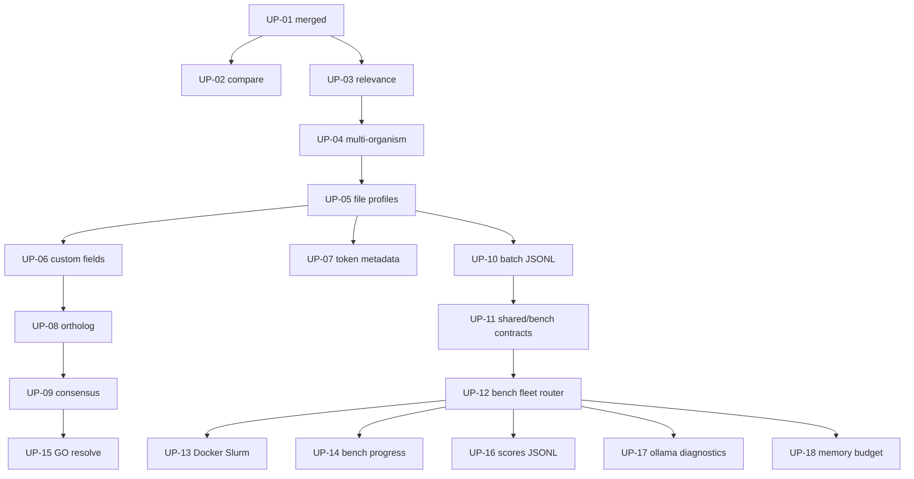

# Upstream Feature PR Queue (CLI / annotation pipeline only)

**Date:** 2026-07-21 (revised 2026-08-10)  
**Status:** approved — living document  
**Target:** [ethanbustad/gene-autoannotator](https://github.com/ethanbustad/gene-autoannotator)  
**Scope:** Bare CLI annotation program + local bench throughput — **not** the web architecture.

## Goals

- Land **annotation pipeline** changes into Ethan’s repo as reviewable feature PRs.
- Keep existing pipeline PRs: UP-01 merged (#2), UP-02 (#3) and UP-03 (#4) open.
- Prefer **CLI / file-based** shapes: `data/profiles/`, CLI flags, bench JSONL — not FastAPI/Mongo/UI.
- Include **worker bench** + fleet + model router + Docker/Slurm bench path — **not** `serve` / coordinator claiming.
- Include August pipeline work (GO resolve, scores JSONL, Ollama diagnostics, model memory budget).
- Open PRs chronologically in **small stacked batches**.
- Keep this file as the source of truth; append `UP-NN` as new CLI/pipeline features land.

## Non-goals

- Frontend, coordinator HTTP APIs, Mongo-backed history/search, job tiles, Fleet UI, regex helper UI.
- `worker/serve.py` and worker↔coordinator lease/claim loop.
- Upstreaming **any `tests/`** (agent-generated or otherwise) — tests stay local / untracked.
- Dumping the entire queue at once; rewriting Ethan’s history; replaying merge-chaos commits.

## Workflow (locked)

1. Develop normally on the fork (`master`).
2. Cut each PR from Ethan’s current `master`, or from the previous stack tip when stacking.
3. Apply an **end-state file snapshot** for that feature’s paths (named paths only).
4. **Never stage `tests/`** or web-only trees (`frontend/`, `coordinator/`, `backend/` except if a tiny shared helper is truly required — prefer `autoannotation/` + `shared/` + `worker` bench paths).
5. Multiple open PRs OK in small stacks; note dependencies in PR bodies.
6. Append new CLI/pipeline work at UP-19+.

### Remotes

```bash
git remote add upstream git@github.com:ethanbustad/gene-autoannotator.git   # if missing
git fetch upstream
git fetch origin
```

### Extraction method (per PR)

1. Identify include paths + tip SHA where the feature is complete on the fork.
2. From `upstream/master` (or stack tip), check out those paths from the tip SHA.
3. Commit with a clear message (`feat: …`).
4. Do **not** include `tests/`. Optional local smoke (`python -m autoannotation --help`, import checks) is fine.

Do **not** use `git add .` / `git add -A`.

## Size reference

**UP-03 (PMC relevance filter)** remains the calibration unit (~6–11 files, ~0.75–1.6k LOC, **excluding tests**).

## Global exclude (never upstream)

- **`tests/`** (entire tree)
- `frontend/`, `coordinator/`, `backend/` (web control plane)
- `worker/serve.py`, `worker/sources/coordinator.py`, Fleet/Jobs UI
- `log*.txt`, `error_log.txt`, `run_log.txt`, `*.sqlite3`
- `.env`, `worker.env`, credentials, `.cache/`, `.venv/`, `node_modules/`
- Generated dumps (`gen_json/`, large pipeline outputs) unless Ethan asks
- Observational memory profiler (`scripts/profile_job_memory.py`) — deferred unless requested

**Allowed minimal shared:** `shared/job_contract.py`, `shared/job_progress.py` (and similar) only when bench needs them.

## How to append

1. Add `### UP-NN` at the bottom (next free number).
2. Fill Status, Era, Depends on, Include, Exclude, Notes.
3. Update summary table + mermaid.
4. Status values: `queued` | `in_progress` | `open` | `merged` | `deferred` | `dropped` | `skipped`

---

## Dependency overview



## Summary table

| ID | Title | Depends | Status |
|----|-------|---------|--------|
| UP-01 | Lite/performance model modes | — | merged (#2) |
| UP-02 | Compareannotations harness | UP-01 | open (#3) |
| UP-03 | PMC relevance + paper budget | UP-01 | open (#4) |
| UP-04 | Multi-organism / strain + CLI targets | UP-03 | queued |
| UP-05 | File-based hybrid profiles + CLI | UP-04 | queued |
| UP-06 | Custom annotation fields | UP-05 | queued |
| UP-07 | Token / usage metadata (pipeline) | UP-05 | queued |
| UP-08 | Ortholog fallback (v1 + redesign) | UP-06 | queued |
| UP-09 | Hybrid section consensus | UP-08 | queued |
| UP-10 | CLI/bench batch parse + JSONL source | UP-05 | queued |
| UP-11 | Shared job contract + progress (minimal) | UP-10 | queued |
| UP-12 | Worker bench + fleet + model router | UP-11 | queued |
| UP-13 | Worker-bench Docker + Slurm | UP-12 | queued |
| UP-14 | Bench dashboard + structured progress | UP-12 | queued |
| UP-15 | GO resolve + pipeline wiring | UP-09 | queued |
| UP-16 | Pipeline scores JSONL | UP-12 | queued |
| UP-17 | Ollama log diagnostics / server log capture | UP-12 | queued |
| UP-18 | Worker model memory budget | UP-12 | queued |
| UP-19+ | *(append new CLI/pipeline features)* | … | — |

### Dropped (web-only — do not upstream in this queue)

Old web-centric IDs: Next.js/FastAPI scaffold, Mongo annotation reads, regex helper UI, version-history UI, web batch store/API, coordinator/serve split, Fleet page/CI-for-web, job-tile resolved names, frontend progress tiles, test-alignment-as-upstream-PR.

---

## Queue entries

### UP-01 — Add lite/performance model modes

- **Status:** merged
- **Include:** `autoannotation/models.py`, mode wiring, README notes
- **Exclude:** tests, generated runs
- **PR:** https://github.com/ethanbustad/gene-autoannotator/pull/2

### UP-02 — Add annotation comparison scoring harness

- **Status:** open
- **Include:** `compareannotations/`, `run_pipeline.py`, `requirements.txt` (compare deps)
- **Exclude:** **`tests/`**, `gen_json/`, `trust_json/` bulk
- **Notes:** Strip any already-pushed test files from the PR branch when convenient (no new PRs required for that cleanup).
- **PR:** https://github.com/ethanbustad/gene-autoannotator/pull/3

### UP-03 — Improve PMC relevance ranking and paper-selection budget

- **Status:** open
- **Include:** `autoannotation/pmc.py`, `metadata.py`, `autoannotation.py`, `get_papers.py`
- **Exclude:** **`tests/`**, llms prompt polish deferred if separate
- **PR:** https://github.com/ethanbustad/gene-autoannotator/pull/4

### UP-04 — Multi-organism / strain validation + CLI target resolution

- **Status:** queued
- **Depends on:** UP-03
- **Include:** `autoannotation/organisms.py`, `targets.py`, `validate.py`, related CLI wiring
- **Exclude:** web validate API, UI, tests

### UP-05 — File-based hybrid profiles + CLI

- **Status:** queued
- **Depends on:** UP-04
- **Include:** profile load/seed under `data/profiles/`, CLI `--profile` / ad hoc organism/strain, `USAGE.md` CLI bits as needed
- **Exclude:** Mongo profile store, ProfileWorkspace UI, coordinator profile APIs, tests

### UP-06 — Custom annotation fields

- **Status:** queued
- **Depends on:** UP-05
- **Include:** `autoannotation/field_defs.py`, profile/pipeline wiring
- **Exclude:** CustomFieldsEditor UI, tests

### UP-07 — Token / usage metadata (pipeline)

- **Status:** queued
- **Depends on:** UP-05
- **Include:** `autoannotation/llms.py` / `metadata.py` token capture
- **Exclude:** frontend display, tests

### UP-08 — Ortholog fallback

- **Status:** queued
- **Depends on:** UP-06
- **Include:** `orthology.py`, `ortholog_lookup.py`, merge/metadata, CLI ortholog flags
- **Exclude:** JobWorkspace ortholog UI, tests
- **Notes:** May ship as one PR or split v1 vs redesign if review asks

### UP-09 — Hybrid section consensus

- **Status:** queued
- **Depends on:** UP-08
- **Include:** `autoannotation/consensus.py`, LLM consensus wiring
- **Exclude:** prototype dumps, tests

### UP-10 — CLI/bench batch parse + JSONL source

- **Status:** queued
- **Depends on:** UP-05
- **Include:** `autoannotation/batch_parse.py`, `batch_resolution.py`, `worker/sources/batch.py`
- **Exclude:** `coordinator/batch_store.py`, BatchJobForm UI, tests

### UP-11 — Shared job contract + progress (minimal)

- **Status:** queued
- **Depends on:** UP-10
- **Include:** minimal `shared/job_contract.py`, `shared/job_progress.py` (bench-needed surface only)
- **Exclude:** coordinator worker registry APIs, tests

### UP-12 — Worker bench + fleet + model router

- **Status:** queued
- **Depends on:** UP-11
- **Include:** `worker/bench.py`, fleet/, router/, runtime/executor pieces needed for bench
- **Exclude:** `worker/serve.py`, `worker/sources/coordinator.py`, Fleet UI, tests

### UP-13 — Worker-bench Docker + Slurm

- **Status:** queued
- **Depends on:** UP-12
- **Include:** `deploy/docker` / `deploy/slurm` bench paths, related docs/examples (no secrets)
- **Exclude:** full web compose stack unless required for bench image alone, tests

### UP-14 — Bench dashboard + structured progress emitters

- **Status:** queued
- **Depends on:** UP-12
- **Include:** `worker/bench_dashboard.py`, pipeline progress emitters consumed by bench
- **Exclude:** coordinator progress PATCH for Jobs UI, frontend tiles, tests

### UP-15 — GO resolve + pipeline wiring

- **Status:** queued
- **Depends on:** UP-09
- **Include:** `goresolve/`, `autoannotation/go_resolution.py`, profile flag wiring
- **Exclude:** profile editor UI toggle-only bits if inseparable from web — prefer CLI/profile JSON flag, tests

### UP-16 — Pipeline scores JSONL

- **Status:** queued
- **Depends on:** UP-12
- **Include:** pipeline scores JSONL writers/readers as designed
- **Exclude:** web-only consumers, tests

### UP-17 — Ollama log diagnostics / server log capture

- **Status:** queued
- **Depends on:** UP-12
- **Include:** fleet/worker Ollama log diagnostics modules
- **Exclude:** tests; split into two PRs if review too large

### UP-18 — Worker model memory budget

- **Status:** queued
- **Depends on:** UP-12
- **Include:** memory budget sizing/classify for worker fleet/bench
- **Exclude:** tests

### UP-19+ — (template)

```markdown
### UP-NN — <Title>

- **Status:** queued
- **Era:** YYYY-MM-DD
- **Depends on:** UP-…
- **Include:** …
- **Exclude:** tests/, frontend/, coordinator/, …
- **Notes:** …
- **PR:** (url when open)
```

---

## Execution checklist (per PR)

- [ ] Base = Ethan `master` or prior stack tip
- [ ] Named-path snapshot only; **no `tests/`**
- [ ] No web trees unless explicitly allowed above
- [ ] Push + open PR; record URL here
- [ ] Small batches; stack when dependent

## Current batch note (2026-08-10)

- Do **not** open new PRs until asked.
- Fork policy: **`tests/` untracked** (gitignored) so agent test piles stay out of upstream cuts.
- Open #3/#4 should drop test files from the PR diff when cleaned up (amend existing branches; do not open replacements unless necessary).
