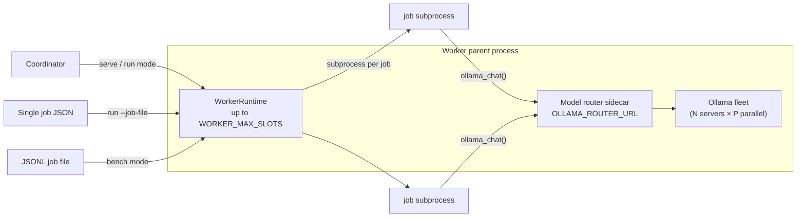

# Gene Autoannotator Worker

The worker runs the annotation pipeline on a remote machine. It probes local
hardware, sizes and launches a homogeneous Ollama fleet, starts a model router
sidecar, and executes jobs concurrently in subprocesses. All LLM calls go through
the router — job subprocesses never talk to Ollama directly.

Three modes share the same annotation runtime and subprocess execution path:

| Mode | Command | Purpose |
| --- | --- | --- |
| **serve** | `python -m worker serve` | Connect to a coordinator, claim jobs continuously, report progress |
| **run** | `python -m worker run --claim-one` | Claim at most one coordinator job, report its result, and exit |
| **bench** | `python -m worker bench` | Run a fixed JSONL batch locally, exit with a `jobs_per_hour` report |

`python -m worker` with no subcommand defaults to **serve** (backward compatible).

## Architecture



**Startup sequence (both modes):**

1. **Probe** — `worker.probe.probe_system()` reads GPU VRAM, system RAM, and CPU.
2. **Size** — `worker.fleet.sizing` recommends `(servers, parallel, max_slots)` from model footprint and hardware.
3. **Configure** — interactive prompts (TTY) or saved `worker.env` values (`OLLAMA_FLEET_*`, `WORKER_MAX_SLOTS`).
4. **Launch fleet** — one `ollama serve` subprocess per server, each with `OLLAMA_NUM_PARALLEL`.
5. **Pull models** — `ensure_models()` on the primary backend.
6. **Start router** — localhost HTTP sidecar; sets `OLLAMA_ROUTER_URL` for child processes.
7. **Run** — `WorkerRuntime` fills up to `WORKER_MAX_SLOTS` concurrent job subprocesses.

## Serve mode

Serve mode registers with the coordinator, heartbeats aggregate slot state, and
claims jobs until drained or interrupted.

Serve and scheduler-launched workers can consume the same backend queue. Both
fleets pull work by claiming jobs; the backend does not push jobs to either
fleet:

```bash
# laptop
BACKEND_URL=https://api.example WORKER_API_TOKEN=… python -m worker serve

# HPC scrontab
*/5 * * * * cd /opt/gene-autoannotator && .venv/bin/python -m dispatcher once
```

```bash
COORDINATOR_URL=http://<coord-host>:8000 \
WORKER_API_TOKEN=<token> \
python -m worker serve
```

Or with explicit CLI overrides:

```bash
python -m worker serve \
  --coordinator-url http://192.168.1.10:8000 \
  --token dev-token \
  --memory-gb 48   # sets WORKER_MODEL_MEMORY_BUDGET_GB (model/Ollama cap; not job slots)
```

On startup the worker logs `Registered worker <name> (<slots> slots)`. The
coordinator biases claims toward workers reporting the most `free_slots`.

Serve mode does **not** collect router metrics. Heartbeats report a single
aggregate `active_jobs` / `free_slots` pair for the whole runtime.

### Drain and version checks

Heartbeats include `state="ready"` until the coordinator signals drain (or a
version mismatch). Active subprocesses finish; no new jobs are claimed; state
switches to `"draining"`.

### Live dashboard and logs

Like bench, `worker serve` shows an in-place terminal dashboard on a TTY:
fleet/slot summary, one line per active job (phase, `sections_done` /
`sections_total`, elapsed), and GPU/CPU/RAM snapshots — using `uptime` instead
of a fixed batch total/queued count, since serve claims jobs indefinitely.

| Flag / env | Purpose |
| --- | --- |
| `--no-dashboard` | Force linear log lines on stdout instead of the TUI |
| `WORKER_SERVE_DASHBOARD=0` | Same as `--no-dashboard` (default is on when stdout is a TTY) |
| `WORKER_LOG_FILE` | Verbose log destination override |

When the dashboard is on and no explicit log file is set, verbose logs default
to `worker-serve.log` under `WORKER_OUTPUT_DIR` (or the current directory) so
stdout stays reserved for the dashboard. Managed Ollama serve output is teed to
`ollama-server-<port>.log` in the same directory; the dashboard **OLLAMA**
section shows pid/status and a parsed summary (phase, last chat, alerts). Full
raw serve logs remain on disk; summarize offline with
`python -m worker.fleet.diagnose_ollama_log ollama-server-<port>.log`.

Non-TTY runs (systemd, Docker without `-t`, nohup, redirected output) skip the
dashboard automatically and log to stdout at INFO as before. **Docker and
systemd deployments that want the live dashboard must allocate a TTY** — pass
`-t` (and typically `-i`) to `docker run`/`docker exec`, or set
`StandardOutput=tty` / run under a pty for the systemd unit; otherwise
`sys.stdout.isatty()` is `False` and the dashboard is disabled (which is the
correct, expected behavior for a background service — logs go to stdout/the
unit journal instead).

### Progress reporting to the coordinator

Per-job progress (phase, `sections_done`/`sections_total`, ortholog
`pass_name`) is **not** carried on heartbeats. Heartbeats stay scoped to
worker-level health: `state`/slots/drain signaling only.

Structured progress is sent on its own path: each `WorkerRuntime` progress
event for a job is debounced per-job by `ProgressReporter` and forwarded via
`PATCH /jobs/{id}/progress` (`CoordinatorClient.progress`), which also renews
the job's lease. The first event for a job and every phase change are sent
immediately; same-phase section updates are coalesced to at most one send per
debounce window; job completion/failure always flushes the latest pending
update.

| Variable | Default | Purpose |
| --- | --- | --- |
| `WORKER_PROGRESS_DEBOUNCE_SEC` | `1.5` | Minimum seconds between progress PATCHes for the same job while its phase is unchanged. |

The coordinator persists these fields on the job record and exposes them via
`GET /jobs`; the frontend Jobs page renders them on each job tile as
`<phase> · <done>/<total> sections` with an ortholog-aware progress bar
(fetching holds at ~5%, then target extraction fills the rest of the bar
until an ortholog progress event is confirmed, at which point the bar remaps
to target `0–50%` then ortholog `50–100%`), falling back to the coarse
status-based label/percent for jobs without structured fields.

## Run mode

Run mode is the one-shot coordinator mode used by schedulers such as Slurm. It
uses the same `WorkerRuntime` and annotation subprocess path as serve, but never
enters a claim loop.

Register an ephemeral worker, attempt exactly one claim, then exit:

```bash
BACKEND_URL=https://backend.example.org \
WORKER_API_TOKEN=<token> \
python -m worker run --claim-one
```

An empty queue returns exit code 0 before starting the local Ollama fleet. When
a job is claimed, run mode probes the allocation, launches the supervised
Ollama fleet, ensures required models, starts the localhost router, and exports
`OLLAMA_ROUTER_URL` before annotation. The ephemeral registration advertises
one slot and uses the Slurm job id (or process id) in its worker name so it
cannot collide with a persistent serve worker on the same hostname.

Run mode heartbeats for as long as the claimed job runs, so the backend keeps
the job's lease fresh and does not requeue work that is still progressing. On
exit — whether the job completed, failed, or the queue was empty — the
ephemeral worker deregisters itself, leaving no stale entry in `GET /workers`.
A deregistration failure is logged and never changes the exit code.

To execute a payload already materialized by a scheduler, skip registration and
claiming:

```bash
python -m worker run --job-file /path/to/job.json
```

The JSON file contains the backend job id and its annotation request:

```json
{
  "job_id": "job-123",
  "request": {
    "profile": "mtb-h37rv",
    "locus": "Rv0001",
    "allow_online_name_lookup": false
  }
}
```

## Bench mode

Bench mode reads a JSONL file of `AnnotationJobRequest` objects, runs the batch
to completion, writes a JSON report, and exits. Use it to compare fleet
configurations on a given machine.

```bash
AUTOANNOTATION_MODEL_MODE=nano \
python -m worker bench \
  --jobs tests/fixtures/bench_jobs_2.jsonl \
  --cache cold \
  --report reports/nano_2x2_j2.json
```

Override concurrent slots (defaults to `WORKER_MAX_SLOTS` from fleet config):

```bash
python -m worker bench \
  --jobs my_jobs.jsonl \
  --slots 4 \
  --cache cold \
  --report reports/run.json
```

See [`docs/worker-bench-protocol.md`](../docs/worker-bench-protocol.md) for the
standard scenario matrix, cold-cache requirements, and report field definitions.

### Live dashboard and logs

On an interactive terminal (TTY), bench shows an in-place dashboard: batch
counts, per-slot job progress (phase and `sections_done` / `sections_total`),
and GPU/CPU/RAM snapshots. Verbose logs go to a file so stdout stays readable.

| Flag / env | Purpose |
| --- | --- |
| `--no-dashboard` | Force linear `_progress` lines on stdout instead of the TUI |
| `WORKER_BENCH_DASHBOARD=0` | Same as `--no-dashboard` (default is on when stdout is a TTY) |
| `--log-file PATH` | Verbose log destination (default when dashboard is on: `worker-bench.log` next to `--report` or `--output-dir`) |
| `WORKER_LOG_FILE` | Same as `--log-file` |

Non-TTY runs (Slurm log files, pipes) skip the dashboard automatically and log
to stdout at INFO as before.

Job subprocesses emit structured `JobProgressEvent` updates (phase, section
counts, optional ortholog pass) on stderr as NDJSON; the dashboard consumes
these for per-job lines. The same contract extends `JobProgress` for future
coordinator/API wiring.

## Fleet setup

On first run (or when fleet env vars are missing), the worker probes hardware
and recommends a fleet configuration. In an interactive terminal it prompts
for:

- **model memory budget** — `WORKER_MODEL_MEMORY_BUDGET_GB`, the cap for Ollama
  model weights / KV (not job subprocess RAM). `-1` or omit uses the
  machine-derived maximum. Influences tier classification and fleet
  recommendations; it does **not** set job slot count.
- **servers** — number of homogeneous `ollama serve` processes
- **parallel per server** — `OLLAMA_NUM_PARALLEL` on each server
- **max job slots** — `WORKER_MAX_SLOTS`, the concurrent subprocess cap

Operator knobs (`OLLAMA_FLEET_SLOT_CTX`, `OLLAMA_FLEET_KEEP_ALIVE`,
`OLLAMA_MAX_LOADED_MODELS`, `AUTOANNOTATION_SECTION_CHUNKING`) are
**write-if-missing** on first ensure — defaults are persisted to `worker.env`
and never overridden by VRAM tier on later starts.

Recommended defaults come from `worker.fleet.sizing.recommend()`. Impossible
configs are rejected; risky ones (e.g. more servers than GPUs) emit warnings
but can be accepted.

Values are persisted to `worker.env` (or `WORKER_ENV_FILE`). Saved keys are
the source of truth — explicit values (including `OLLAMA_FLEET_KEEP_ALIVE`) are
not silently overwritten on subsequent starts:

```bash
WORKER_MODEL_MEMORY_BUDGET_GB=24
OLLAMA_FLEET_SERVERS=2
OLLAMA_FLEET_PARALLEL=2
WORKER_MAX_SLOTS=4
OLLAMA_FLEET_KEEP_ALIVE=0
OLLAMA_MAX_LOADED_MODELS=1
AUTOANNOTATION_SECTION_CHUNKING=true
OLLAMA_FLEET_W_ALL_BYTES=2147483648
OLLAMA_FLEET_C_SLOT_BYTES=429496729
```

Subsequent runs load these values non-interactively. To reconfigure, delete the
fleet keys from `worker.env` and restart.

### Fleet sizing model

VRAM per server is estimated as `W_all + parallel × C_slot`:

- **W_all** — bytes to keep all required models warm on one server (measured or
  estimated from `AUTOANNOTATION_MODEL_MODE`).
- **C_slot** — per-lane context overhead (~0.4 GB default).

`max_slots` is capped by Ollama gates (`servers × parallel`), available RAM
(subprocess overhead), and physical CPU count. Recommended defaults keep
`max_slots == agg_lanes` so job concurrency matches what Ollama can serve.

## Model router sidecar

The worker parent starts a localhost HTTP router before any jobs run. Each Ollama
server has a **server gate** with capacity `OLLAMA_FLEET_PARALLEL`: at most that
many concurrent HTTP requests to one `ollama serve` process, regardless of model.
Jobs queue at the router when the gate is full; slots still run non-LLM work in
parallel.

`autoannotation.llms.ollama_chat()` is the single integration point: when
`OLLAMA_ROUTER_URL` is set, calls go to `POST /v1/chat` on the sidecar instead
of Ollama directly. The sidecar forwards to the selected backend; read timeout is
**unlimited by default** (performance models may run many minutes). Set
`OLLAMA_CHAT_TIMEOUT_SEC` only for bench fail-fast.

### Concurrency (one story)

| Knob | Env / flag | What it limits |
| --- | --- | --- |
| **Slots** | `WORKER_MAX_SLOTS` / `--slots` | Concurrent annotation subprocesses |
| **Server gate** | `OLLAMA_FLEET_PARALLEL` | Concurrent Ollama HTTP requests per server |
| **Chat timeout** | `OLLAMA_CHAT_TIMEOUT_SEC` (optional) | Max seconds one inference may run; unset = unlimited |

With `parallel=1` on a single GPU, Ollama processes one request at a time; four
slots still overlap paper fetch and Python work while LLM calls queue at the router.

When `OLLAMA_CHAT_TIMEOUT_SEC` is set, hung calls return HTTP 504, release the
gate, and fail the job. Leave it unset for overnight serve runs with large models.

**Ollama disappeared mid-job?** Serve mode starts a managed `ollama serve` child.
Crashes are usually OOM (performance models exceed VRAM) or the Linux OOM killer,
not the router HTTP layer itself. **`OLLAMA_MAX_LOADED_MODELS`** and
**`OLLAMA_FLEET_KEEP_ALIVE`** come from `worker.env` (materialized on first
ensure; tier never overwrites them). Pre-warm is skipped; models load on first use.
The supervisor **no longer kills** a busy Ollama just because `/api/tags` is
slow during inference. Watch for `Ollama server ... exited unexpectedly` in logs.

Environment variables:

| Variable | Default | Purpose |
| --- | --- | --- |
| `OLLAMA_ROUTER_URL` | set by worker | Router base URL (e.g. `http://127.0.0.1:11999`). Injected into job subprocesses. |
| `OLLAMA_ROUTER_HOST` | `127.0.0.1` | Bind address for the sidecar (serve mode). |
| `OLLAMA_ROUTER_PORT` | `0` (ephemeral) | Listen port; `0` picks a free port. |

In **bench** mode the router collects per-call and per-job metrics used in the
report. In **serve** mode metrics collection is disabled.

## Subprocess jobs

Each job runs in a fresh Python subprocess (`worker.job_main`) by default.
This isolates memory and keeps the parent process stable under concurrent load.

| Variable | Default | Purpose |
| --- | --- | --- |
| `WORKER_JOB_EXECUTION` | `subprocess` | `subprocess` (default) or `inprocess` (tests/debug). Subprocess children always run `inprocess`. |
| `WORKER_MAX_SLOTS` | from fleet config | Maximum concurrent job subprocesses. |

The parent `WorkerRuntime` maintains a thread pool of up to `WORKER_MAX_SLOTS`
workers. Each slot runs one annotation subprocess at a time. The coordinator
sees one worker with `max_slots` equal to this value.

### Memory admission

**Model memory budget** (`WORKER_MODEL_MEMORY_BUDGET_GB`, or legacy
`ANNOTATION_MEMORY_BUDGET_GB` read once for migration) caps how much RAM/VRAM
the worker may use for Ollama model memory. It affects fleet recommendations
and feasibility warnings. It does **not** derive job slot count.

When fleet env vars are set, slots come directly from `WORKER_MAX_SLOTS` — not
from the model budget or the legacy per-job 20 GB estimate.

Admission before each claim checks only subprocess overhead:

```python
SUBPROCESS_OVERHEAD_BYTES = 2 * 1024**3  # ~2 GB per job (Python, papers, cache)
```

`can_admit()` returns true when `memory_available_bytes >= SUBPROCESS_OVERHEAD_BYTES`.

The legacy `ANNOTATION_MEMORY_BUDGET_GB` / `JOB_MEMORY_ESTIMATE_GB` path still
works as a fallback when fleet keys are absent (older deployments): budget and
per-job estimate drive `capacity.compute_slots()`. New setups should use the
fleet configuration flow and `WORKER_MODEL_MEMORY_BUDGET_GB`.

## Environment variables

### Coordinator (serve mode)

| Variable | Required | Default | Purpose |
| --- | --- | --- | --- |
| `COORDINATOR_URL` | **yes** (serve) | — | Base URL of the coordinator, e.g. `http://coord-host:8000`. |
| `WORKER_API_TOKEN` | recommended | `""` | Shared secret sent as `Authorization: Bearer <token>`. |
| `WORKER_NAME` | no | hostname | Human-readable name reported at registration. |
| `APP_VERSION` | no | `dev` | Agent version (checked against coordinator `REQUIRED_WORKER_VERSION`). |
| `HEARTBEAT_SECONDS` | no | `15` | Heartbeat interval. |

### Fleet and concurrency

| Variable | Default | Purpose |
| --- | --- | --- |
| `WORKER_MODEL_MEMORY_BUDGET_GB` | from prompt | Model weights / KV / Ollama memory cap (GB). `-1` or omit = machine cap. Does not set slots. |
| `OLLAMA_FLEET_SERVERS` | from sizing | Number of `ollama serve` processes. |
| `OLLAMA_FLEET_PARALLEL` | from sizing | `OLLAMA_NUM_PARALLEL` per server. |
| `OLLAMA_FLEET_SLOT_CTX` | `8192` | Per-slot context tokens (operator knob). Managed serve sets child `OLLAMA_CONTEXT_LENGTH = slot × parallel`. When chunking is off, Ollama still truncates prompts exceeding slot context. |
| `OLLAMA_MAX_LOADED_MODELS` | tier-based once | Write-if-missing: model count if `warm_stack`, else `1`. Never tier-overwritten after materialize. |
| `WORKER_MAX_SLOTS` | from sizing | Concurrent job subprocess cap (separate from model memory budget). |
| `OLLAMA_FLEET_KEEP_ALIVE` | `0` | Ollama unload policy (`0`, `5m`, `-1`, …). Write-if-missing; never overridden by tier. Copied to `AUTOANNOTATION_OLLAMA_KEEP_ALIVE`. |
| `OLLAMA_FLEET_W_ALL_BYTES` | measured/estimated | All-models-warm VRAM footprint per server. |
| `OLLAMA_FLEET_C_SLOT_BYTES` | `429496729` (~0.4 GB) | Per-lane context VRAM estimate. |

### Router and pipeline

| Variable | Default | Purpose |
| --- | --- | --- |
| `OLLAMA_ROUTER_URL` | set by worker | Router sidecar URL; propagated to job subprocesses. |
| `AUTOANNOTATION_MODEL_MODE` | `performance` | Model stack: `performance`, `lite`, or `nano`. |
| `AUTOANNOTATION_OLLAMA_KEEP_ALIVE` | synced from fleet | Copied from `OLLAMA_FLEET_KEEP_ALIVE` after materialize. Bench `--keep-alive` overrides for that run. |
| `AUTOANNOTATION_SECTION_CHUNKING` | `true` | Write-if-missing. `false` = July-style full sections (no excerpt splitting). |
| `AUTOANNOTATION_OLLAMA_WARM_ALL` | unset | Set to `1` in serve mode to pre-load all required models at startup. |
| `WORKER_JOB_EXECUTION` | `subprocess` | Parent execution mode: `subprocess` or `inprocess`. |

### Paths and legacy budget

| Variable | Default | Purpose |
| --- | --- | --- |
| `WORKER_CACHE_DIR` | `./.cache` | Annotation cache root (bench cold purge targets `llm_cache` / `llm_responses` here). |
| `WORKER_OUTPUT_DIR` | `gen_json` | Annotation JSON output directory. |
| `WORKER_ENV_FILE` | `<repo>/worker.env` | Persisted env file for coordinator URL, token, fleet config. Absolute repo-root path by default (not cwd, not output-dir). |
| `ANNOTATION_MEMORY_BUDGET_GB` | — | **Legacy alias** for `WORKER_MODEL_MEMORY_BUDGET_GB`; read once and migrated on persist. Fallback slot math when fleet keys absent. |
| `JOB_MEMORY_ESTIMATE_GB` | `20.0` | Legacy per-job estimate (fallback only). |
| `WORKER_MEMORY_HEADROOM_GB` | `4.0` | Legacy headroom (fallback only). |

## Prerequisites

- Python 3.11+.
- Repository installed with dependencies (`requirements.txt` + `requirements-web.txt`).
- **Ollama** installed; the worker launches its own fleet processes (no manual
  `ollama serve` needed).
- For **serve** mode: a reachable backend (see `backend/README.md`).
- For **bench** mode: sufficient local VRAM/RAM for the chosen fleet and model mode.

Required LLM models are derived from `autoannotation.models` and auto-pulled on
the primary fleet backend before jobs start.

## Local end-to-end smoke test (serve, needs Ollama)

**Terminal 1 — backend:**

```bash
WORKER_API_TOKEN=dev-token uvicorn backend.api:app --host 0.0.0.0 --port 8000
```

**Terminal 2 — worker:**

```bash
COORDINATOR_URL=http://127.0.0.1:8000 \
WORKER_API_TOKEN=dev-token \
python -m worker serve
```

Expect `Registered worker <hostname> (<N> slots)` after fleet setup.

**Verify connection:**

```bash
curl -s http://127.0.0.1:8000/health | python -m json.tool
```

**Submit a job:**

```bash
curl -s -X POST http://127.0.0.1:8000/jobs \
  -H 'Content-Type: application/json' \
  -d '{"profile":"mtb-h37rv","locus":"Rv0001","allow_online_name_lookup":false}'
```

Poll until `queued → running → completed`:

```bash
curl -s "http://127.0.0.1:8000/jobs?order=queue" | python -m json.tool
```

## Quick bench smoke test

```bash
AUTOANNOTATION_MODEL_MODE=nano \
python -m worker bench \
  --jobs tests/fixtures/bench_jobs_2.jsonl \
  --cache cold
```

Check `reports/<timestamp>.json` for `batch.jobs_per_hour > 0`.

## Deployment scripts

Scripts live under `deploy/scripts/`:

| Script | Purpose |
| --- | --- |
| `generate-worker-token.sh` | Emit a random hex token for `WORKER_API_TOKEN`. |
| `test-coordinator-reachability.sh` | Verify LAN connectivity to the coordinator (`curl` `/health`). |
| `install-worker.sh` | Create `.venv`, install dependencies, write `worker.env`. |
| `update-worker.sh` | Drain active jobs, `git pull`, restart the worker. |

### Install a worker

```bash
deploy/scripts/install-worker.sh
```

Non-interactive:

```bash
deploy/scripts/install-worker.sh http://192.168.1.10:8000 "$(deploy/scripts/generate-worker-token.sh)"
```

First run prompts for coordinator URL, token, model memory budget
(`WORKER_MODEL_MEMORY_BUDGET_GB`), and fleet sizing (servers, parallel, slots).
Values are saved to `worker.env`.

### Two-machine LAN setup

**Coordinator machine**

1. Generate token: `deploy/scripts/generate-worker-token.sh`
2. Set `WORKER_API_TOKEN` and `COORDINATOR_PUBLIC_URL=http://<lan-ip>:8000`
3. Start: `uvicorn backend.api:app --host 0.0.0.0 --port 8000`

**Worker machine(s)**

1. `deploy/scripts/install-worker.sh` (or configure `worker.env` manually)
2. `deploy/scripts/test-coordinator-reachability.sh http://<lan-ip>:8000`
3. `python -m worker serve` (or systemd below)

Each worker launches its own Ollama fleet sized to local hardware.

### systemd (production)

```bash
sudo mkdir -p /etc/gene-autoannotator
sudo cp worker.env /etc/gene-autoannotator/worker.env
sudo cp deploy/systemd/gene-autoannotator-worker.service /etc/systemd/system/
sudo systemctl daemon-reload
sudo systemctl enable --now gene-autoannotator-worker
```

The unit runs `python -m worker serve` from `/opt/gene-autoannotator`.

### Updating a worker

```bash
deploy/scripts/update-worker.sh
```

Polls until `active_jobs=0`, then `git pull` and restarts via systemd when enabled.
